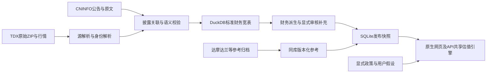

# 数据与估值架构

本页描述当前结构和不变约束；实现范围见[项目状态](implementation-status.md)，历史设计见[早期设计](history/design-v0.md)，具体语义决策见[ADR索引](decisions/README.md)。当前只维护schema55，不保留旧模型兼容层。

## 数据流与责任

TDX是结构化财务数值主源；CNINFO负责公告身份、披露时间、合并范围及原文核验，不静默覆盖TDX。标准字段使用通用业务名称，源编号仅在解析、映射及来源证据中出现。估值方法以达摩达兰原始资料为准，事实、代理与预测分层。

AlphaLake交付事实、参考、确定性派生及显式假设，valuation消费固定契约执行估值。当前优先解决数据侧缺口；引擎仅维护明确BUG和必要接口扩展，额外模型政策单列论证。全部历史改动、达摩达兰依据与待处置项见[架构边界及引擎调整台账](valuation/engine-change-ledger.md)，不能把原页面保留说成引擎未改。

## 存储分层

| 层次 | 当前职责 |
|---|---|
| `core` | 公司、证券、上市及来源标识，按业务时点解析身份 |
| `market` / `classification` | 未复权行情、股本/行动、汇率和时态分类 |
| `fundamental` | 源记录定位、公告关联、标准财务宽表、拒绝原因、逐期间审核补充 |
| `reference` | 版本化国家/行业、风险与成本参考；不是公司事实 |
| `meta` | 原始归档、发布版本、运行、检查点与治理记录 |
| workspace派生文件 | SQLite、估值运行与研究结果，可按输入和版本重建 |

唯一主库是`workspace/alphalake.duckdb`。原始证据按来源归档，源ZIP已保存时不在数据库重复持久化BLOB、原位值或源字段长表。

财务源层`fundamental.source_record`只保存归档、原行和身份定位；`statement_snapshot`按来源记录宽行存标准列，金额采用`DECIMAL(38,10)`，不恢复float32已经丢失的精度。拒绝按记录/规则归并，字段运行血缘只在内容变化时更新。批量查询先限定证券、期间和标准列，禁止逐字段入库或逐公司启动导出进程。基准及发布门槛见[财务存储约束](guides/financial-storage-redesign-20260925.md)。

## 语义与治理

- 证券身份不靠代码前缀猜测；歧义保留，默认批量范围只含沪深，北交所历史不删除。
- 报告期、公告时间、首次取得及系统记录时间分别保存。CNINFO只有日期时，到中国次日零点才可用于PIT；新取得的旧包不冒称当时已留存。
- 累计流量、单季流量、期末余额、每股数值不能混合加总。年度/TTM从已审核标准事实派生；源零不等于披露零。
- 原文核实的余额零通过绑定源归档、映射、公告和PDF的审核补充进入出口，不改标准事实。撤销或绑定失效后重导出恢复缺项。规则见[审核通道](guides/reviewed-evidence-history.md)。
- 原始证据不可变；失败快照不能覆盖可信历史、关闭身份区间或推进完成检查点。对应数据与检查点原子提交，重放幂等。
- 来源当前可用、上游最新、字段齐备、模型准入、估值产出和经济合理性分别验收。

## 应用契约

SQLite是原Investment_Valuation_Agent的可重建输入快照，含财务、参考和独立诊断；网页只读SQLite，不打开大DuckDB。保留原页面及操作流程，JSON政策仅在后端显式接口消费。默认参考、用户修改和人民币候选不能混称公司市场WACC。

原生发布由已有同步、导出、检查和原子切换组成，失败恢复旧快照，成功后用真实API核对输入与结果。CLI/Skill的显式政策估值保留自己的运行标识，不与原生默认估值混同。细节见[发布手册](guides/system-delivery.md)和[导出契约](guides/valuation-sqlite-export.md)。

## 资源与演进

大库操作和全套测试串行运行于独立systemd服务，核验进程硬限额；DuckDB查询预算不是RSS上限。性能、证据和缺项纪律不能靠放大内存或默认补零绕过。

当前无生产部署。模型或接口合法变更时同步调用方、测试、Skill和文档，旧库显式转换或可验证重建；先保护不可重建的证据及审核记录。冻结历史按原提交复验，不为历史结果保留运行时别名，也不把旧方法当作禁止改进的理由。
